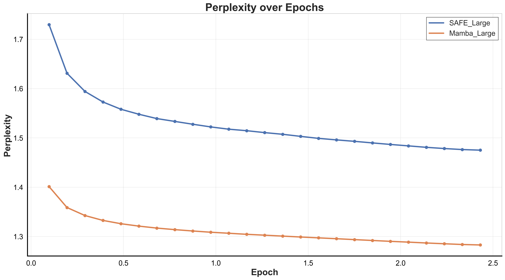

# Mamba-SAFE

Generate drug-like molecules with Mamba state space models trained on the SAFE molecular string representation.

This is the research code behind *Molecular Generation with State Space Sequence Models* ([NeurIPS 2024 Workshop on AI for New Drug Modalities](https://openreview.net/forum?id=1ib5oyTQIb)) and the UCT project report [*Comparing Transformer, MAMBA, and Hybrid Architectures for Molecular Generation using the SAFE Representation*](Papers/Research_Paper.pdf). It compares decoder architectures at roughly 20M and 100M parameters on the same task: a GPT-2 transformer (the SAFE-GPT baseline), a pure Mamba-2 SSM, and (at 20M) a hybrid that interleaves attention layers into the Mamba stack.

<p align="center">
  
  <br><sub>Evaluation perplexity during training, 100M models on ZINC (from <code>Results/loss/*.json</code>, plotted in <code>Results/plots.ipynb</code>).</sub>
</p>

## Background

**SAFE** (Sequential Attachment-based Fragment Embedding) rewrites a SMILES string as an unordered sequence of molecular fragments joined by attachment points, while staying a valid SMILES string. That makes fragment-level tasks such as scaffold decoration, linker design and motif extension plain sequence completion. See Noutahi et al., [*Gotta be SAFE: a new framework for molecular design*](https://arxiv.org/abs/2310.10773) (Digital Discovery, 2024) and the [datamol-io/safe](https://github.com/datamol-io/safe) library ([docs](https://safe-docs.datamol.io/stable/)).

**Mamba** ([Gu & Dao, 2023](https://arxiv.org/abs/2312.00752); [state-spaces/mamba](https://github.com/state-spaces/mamba)) is a selective state space model that scales linearly with sequence length. This repo uses the Mamba-2 layer from `mamba-ssm`, optionally mixed with multi-head attention layers (`attn_layer_idx` in the model config).

The `mamba_safe` package is a fork of the SAFE library's tokenizer, converter, sampler and trainer, with the GPT-2 model swapped for a Mamba language model.

## Repository layout

| Path | What it is |
|---|---|
| `mamba_safe/converter.py` | SMILES to SAFE encoding and decoding (from the SAFE library) |
| `mamba_safe/tokenizer.py` | `SAFETokenizer`, a Hugging Face compatible tokenizer for SAFE strings |
| `mamba_safe/sample.py` | `SAFEDesign`, de novo generation and fragment-constrained sampling with a Mamba model |
| `mamba_safe/utils.py`, `viz.py`, `_exception.py` | Fragmentation helpers, molecule drawing, SAFE error types |
| `mamba_safe/check_libraries.py` | Sanity check that torch, CUDA, transformers and mamba-ssm load |
| `mamba_safe/trainer/mamba_model.py` | `MAMBAConfig` and `MAMBAModel`: the language model, plus `from_pretrained`/`save_pretrained` |
| `mamba_safe/trainer/mixer_seq_simple.py` | Mamba/attention block stack, adapted from `mamba_ssm` with dropout |
| `mamba_safe/trainer/cli.py` | Training entry point (Hugging Face `Trainer` + `HfArgumentParser`) |
| `mamba_safe/trainer/collator.py`, `data_utils.py`, `trainer_utils.py` | Batching, dataset loading/tokenisation, causal-LM loss |
| `scripts_and_configs/example_config.json` | Model config for a 12-layer, d_model 768 Mamba-2 model (the 100M setup) |
| `scripts_and_configs/tokenizer.json` | SAFE tokenizer (1880 tokens), identical to the one shipped with the released models |
| `scripts_and_configs/example.sh` | SLURM training script template |
| `evaluation/simplified_molecule_generator.py` | Sample N molecules from a trained model and write SMILES to a file |
| `evaluation/generation_evaluation_hpc.sh` | SLURM job used to sample 10,000 molecules on the UCT cluster |
| `Results/` | Training-loss logs, evaluation notebooks, property-distribution plots and sample grids |
| `Papers/` | Project proposal, literature review and final research paper (PDF) |

## Released models

All checkpoints are public on the Hugging Face Hub. Architecture details are read from each repo's `config.json`; training data is from each model card.

| Model | Architecture | Layers / width | Training data | Load with |
|---|---|---|---|---|
| [anrilombard/ssm-20m](https://huggingface.co/anrilombard/ssm-20m) | Mamba-2 SSM | 6 / 512 | [MOSES](https://huggingface.co/datasets/katielink/moses) | this repo |
| [anrilombard/hybrid-20m](https://huggingface.co/anrilombard/hybrid-20m) | Mamba-2 + attention at layers 2 and 5 (8 heads) | 6 / 512 | MOSES | this repo |
| [anrilombard/ssm-100m](https://huggingface.co/anrilombard/ssm-100m) | Mamba-2 SSM | 12 / 768 | [ZINC](https://huggingface.co/datasets/sagawa/ZINC-canonicalized) | this repo |
| [anrilombard/safe-20m](https://huggingface.co/anrilombard/safe-20m) | GPT-2 transformer baseline | 6 / 512, 8 heads | MOSES | [`safe-mol`](https://github.com/datamol-io/safe) |
| [anrilombard/safe-100m](https://huggingface.co/anrilombard/safe-100m) | GPT-2 transformer baseline | 12 / 768, 12 heads | ZINC | [`safe-mol`](https://github.com/datamol-io/safe) |

"20M" and "100M" are the parameter budgets the models are named for. The SSM and hybrid repos contain `config.json`, `pytorch_model.bin` and `tokenizer.json` in the format `MAMBAModel.from_pretrained` expects.

## Installation

`mamba-ssm` and `causal-conv1d` compile CUDA kernels, so you need **Linux with an NVIDIA GPU and a CUDA toolkit**. Neither installs on macOS or CPU-only machines.

```bash
git clone https://github.com/Anri-Lombard/Mamba-SAFE.git
cd Mamba-SAFE
# install a CUDA build of PyTorch first: https://pytorch.org/get-started/locally/
pip install -r requirements.txt
pip install -e .
python mamba_safe/check_libraries.py   # confirms torch sees CUDA and mamba-ssm imports
```

Keep `safe-mol` (needed for the GPT-2 `safe-*` checkpoints) in a separate environment from `mamba-safe` to avoid dependency conflicts.

## Usage

### Generate molecules with a released model

```python
import torch
from huggingface_hub import snapshot_download
from mamba_safe import SAFEDesign, SAFETokenizer
from mamba_safe.trainer.mamba_model import MAMBAModel

snapshot_download("anrilombard/ssm-20m", local_dir="ssm-20m")

model = MAMBAModel.from_pretrained("ssm-20m", device=torch.device("cuda"))
tokenizer = SAFETokenizer.from_pretrained("ssm-20m")

designer = SAFEDesign(model=model, tokenizer=tokenizer, verbose=True)
smiles = designer.de_novo_generation(
    n_samples_per_trial=100,
    max_length=100,
    sanitize=True,
    top_k=50,
    top_p=0.9,
    temperature=1.0,
    n_trials=10,
)
print(smiles[:10])
```

Or from the command line, with the sampling settings used in `evaluation/generation_evaluation_hpc.sh` (100 trials of 100 samples):

```bash
cd evaluation
python simplified_molecule_generator.py \
    --model_dir ../ssm-20m \
    --tokenizer_path ../ssm-20m \
    --num_samples 100 --n_trials 100 \
    --max_length 100 --top_k 50 --top_p 0.9 --temperature 1.0 \
    --output_file ssm_20m_samples.txt
```

### Train a model

Training expects a Hugging Face `datasets` dataset (on disk or on the Hub) with a `safe` text column, a `train` split and optionally a `validation` split. To convert SMILES datasets to SAFE, see the [SAFE docs](https://safe-docs.datamol.io/stable/). From the repo root:

```bash
python -m mamba_safe.trainer.cli \
    --config_path scripts_and_configs/example_config.json \
    --tokenizer_path scripts_and_configs/tokenizer.json \
    --dataset_path /path/to/safe_dataset \
    --text_column safe \
    --output_dir runs/ssm-100m \
    --do_train True --do_eval True \
    --learning_rate 1e-4 --weight_decay 0.1 --max_grad_norm 1.0 \
    --per_device_train_batch_size 100 --gradient_accumulation_steps 2 \
    --warmup_steps 10000 --max_steps 250000 \
    --eval_strategy steps --eval_steps 10000 --save_steps 10000 \
    --gradient_checkpointing True --save_safetensors True
```

Training logs to Weights & Biases by default (`--wandb_project`, default `MAMBA_small`); set `WANDB_API_KEY` or `WANDB_MODE=offline`. For the 20M setup, use `"n_layer": 6, "d_model": 512` in the config. For the hybrid, add `attn_layer_idx` and `attn_cfg` as in [hybrid-20m's config.json](https://huggingface.co/anrilombard/hybrid-20m/blob/main/config.json). `scripts_and_configs/example.sh` wraps the full command for SLURM.

## Results

The numbers below are copied from `Results/statistics.ipynb`. Each model generated 10,000 molecules in a single sampling run. Validity = valid molecules / 10,000; uniqueness = unique canonical SMILES / generated; diversity = mean pairwise Tanimoto distance (Morgan, radius 2); QED and SA score are means over valid molecules (lower SA = easier to synthesise). The generated-molecule files themselves aren't in the repo.

**100M models, trained on ZINC** (notebook cell output):

| Model | Validity | Uniqueness | Diversity | QED | SA score |
|---|---|---|---|---|---|
| SAFE-GPT 100M (transformer) | 0.98 | 1.0 | 0.880 | 0.718 | 3.208 |
| SSM 100M (Mamba) | 1.00 | 1.0 | 0.873 | 0.751 | 3.015 |

**20M models, trained on MOSES** (recorded in a markdown cell of the same notebook):

| Model | Validity | Uniqueness | Diversity | QED | SA score |
|---|---|---|---|---|---|
| SAFE-GPT 20M (transformer) | 0.994 | 1.000 | 0.866 | 0.801 | 2.500 |
| SSM 20M (Mamba) | 1.000 | 0.996 | 0.855 | 0.820 | 2.357 |
| Hybrid 20M | 1.000 | 0.997 | 0.856 | 0.816 | 2.357 |

Property distributions (molecular weight, LogP, TPSA, QED and others) against the training set are in `Results/small_plots/` and `Results/large_plots/` (`Results/property_distributions.ipynb`), and grids of sampled molecules are in `Results/*_molecules.png`. See the [research paper](Papers/Research_Paper.pdf) for the full analysis.

## Citation

```bibtex
@inproceedings{lombard2024molecular,
  title     = {Molecular Generation with State Space Sequence Models},
  author    = {Anri Lombard and Shane Acton and Ulrich Armel Mbou Sob and Jan Buys},
  booktitle = {NeurIPS 2024 Workshop on AI for New Drug Modalities},
  year      = {2024},
  url       = {https://openreview.net/forum?id=1ib5oyTQIb}
}
```

Please also cite SAFE and Mamba:

```bibtex
@article{noutahi2024gotta,
  title     = {Gotta be SAFE: a new framework for molecular design},
  author    = {Noutahi, Emmanuel and Gabellini, Cristian and Craig, Michael and Lim, Jonathan SC and Tossou, Prudencio},
  journal   = {Digital Discovery},
  volume    = {3},
  number    = {4},
  pages     = {796--804},
  year      = {2024},
  publisher = {Royal Society of Chemistry}
}

@article{gu2023mamba,
  title   = {Mamba: Linear-time sequence modeling with selective state spaces},
  author  = {Gu, Albert and Dao, Tri},
  journal = {arXiv preprint arXiv:2312.00752},
  year    = {2023}
}
```

## Acknowledgements

The tokenizer, converter, sampler and trainer are adapted from [datamol-io/safe](https://github.com/datamol-io/safe) (Apache-2.0), and the model stack from [state-spaces/mamba](https://github.com/state-spaces/mamba) (Apache-2.0).

## License

[MIT](LICENSE)
